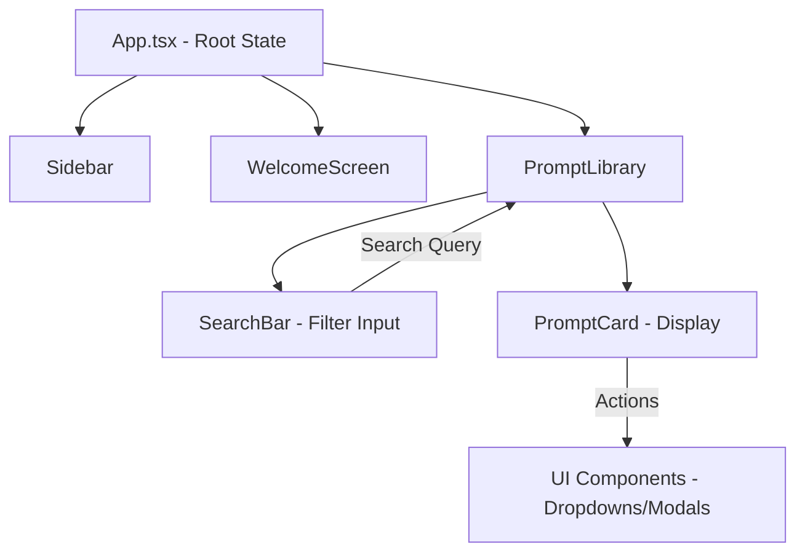

# Data Flow & Integrations

This document describes the flow of data within the application, outlining how information moves from user input through UI components and state management, as well as how the system maintains architectural consistency.

## High-level Flow

The application follows a unidirectional data flow pattern typical of React-based architectures. Data primarily originates from user interactions or initial application state and propagates through the component hierarchy.

1.  **Entry Point**: `App.tsx` serves as the orchestrator, managing high-level application state and routing logic between the `WelcomeScreen` and the main library views.
2.  **Navigation & Context**: The `Sidebar` provides navigation context, interacting with `SidebarProvider` to manage layout state (collapsed/expanded).
3.  **Data Filtering**: The `PromptLibrary` receives the dataset and passes a subset/filtered view to `PromptCard` components based on input from the `SearchBar`.
4.  **UI Feedback**: Interaction with individual cards triggers local state updates or opens UI primitives (like `Dialog` or `DropdownMenu`) for editing or metadata viewing.

## Module Relationships

The system is built on a modular architecture where UI primitives are decoupled from business logic.

### State & Props Distribution
- **App Configuration**: Root level components manage the display mode (Grid vs. List) and active views.
- **Component Communication**: Communication between deeply nested components (like a button inside a card inside a grid) is handled via prop drilling for simple relationships and **Context Providers** (e.g., `TooltipProvider`, `SidebarContext`) for global UI states.
- **Utility Integration**: Almost all UI components rely on a centralized `cn` utility (defined in `docs\archive\src\app\components\ui\utils.ts`) for deterministic Tailwind CSS class merging.

## Internal Data Movement

### UI Component Lifecycle
1.  **Input**: Components like `Input`, `Textarea`, and `Select` capture raw user data.
2.  **Validation**: `Form` and `FormControl` components (using `react-hook-form` patterns) wrap these inputs to provide validation states and error messages.
3.  **Transformation**: Data is structured according to TypeScript interfaces (e.g., `PromptCardProps`) before being rendered or passed to action handlers.

### Shared UI Patterns
The repository utilizes a standardized set of UI primitives based on Radix UI. Data flows through these primitives via:
- **Triggers & Content**: Patterns seen in `Popover`, `Tooltip`, and `DropdownMenu` where a "Trigger" component signals a state change to a "Content" portal.
- **Controlled vs. Uncontrolled**: Most form elements support both controlled (via `value` prop) and uncontrolled (via `defaultValue`) patterns to accommodate different integration needs.

## External Integrations

### Gemini & AI Services
Based on the project structure (specifically `GEMINI.md`), the application is designed to interface with Google's Gemini API:
- **Payload Shape**: Typically involves sending text prompts and receiving structured JSON or markdown responses.
- **Integration Layer**: Though not explicitly detailed in the component tree, these interactions are generally abstracted into custom hooks or utility functions that handle the `fetch` requests and API key management.

### Figma Integration
The `ImageWithFallback` and other assets within `docs\archive\src\app\components\figma\` suggest a workflow where UI designs or image assets are programmatically pulled or referenced from Figma exports.

## Observability & Failure Modes

### Error Handling
- **Fallback UI**: The `ImageWithFallback` component demonstrates a pattern for handling broken external resource links by providing a placeholder or alternative image.
- **Form Validation**: The `form.tsx` implementation ensures that invalid data is caught before being processed by the application logic, providing immediate feedback via `FormMessage`.

### Loading States
- **Skeletons**: The `Skeleton` component is used across the `Sidebar` and `PromptLibrary` to manage data flow perception, ensuring a smooth transition while asynchronous data (like prompt lists) is being fetched.

## Data Schema Summary

| Entity | Primary File | Key Fields |
| :--- | :--- | :--- |
| **Prompt** | `PromptCard.tsx` | `title`, `description`, `tags`, `category` |
| **Layout State** | `sidebar.tsx` | `open`, `setOpen`, `isMobile` |
| **View Mode** | `PromptLibrary.tsx` | `'grid'`, `'list'` |
| **Form State** | `form.tsx` | `values`, `errors`, `isSubmitting` |
